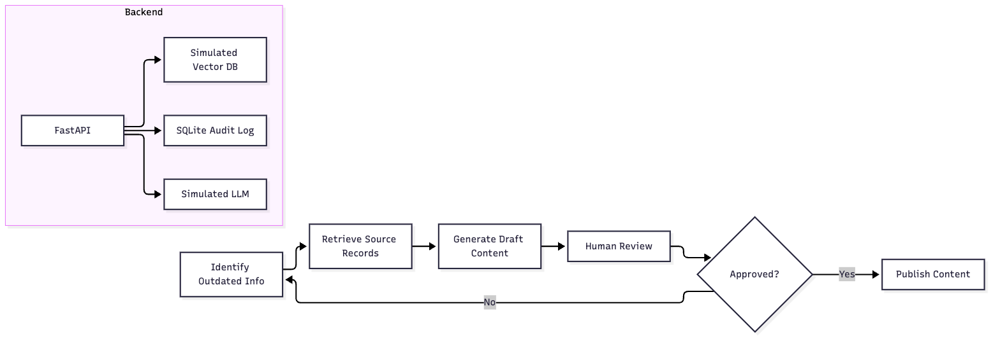
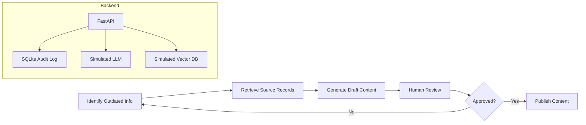

# CivicDraft MVP

A small, working Python MVP inspired by government content drafting systems.

## Core Job
Draft compliant government content with verifiable sources for human approval.

## Workflow
1. Identify outdated or missing public information.
2. Draft or retrieve source material from official records.
3. Generate proposed content updates.
4. Human editor reviews and approves changes.
5. Publish approved content.

## Components
- Local LLM (Simulated): Content generation.
- Vector Database (Simulated): Source retrieval.
- FastAPI Backend: API handling.
- SQLite: Audit logging and user data.

## Setup
1. Install dependencies: `pip install -r requirements.txt`
2. Run tests: `pytest -q`
3. Run demo: `python -c "from main import demo; demo()"`

## API Endpoints
- `POST /drafts`: Create a new draft.
- `GET /drafts`: List all drafts.
- `POST /drafts/{id}/approve`: Approve a draft.

## Architecture

Mermaid source

